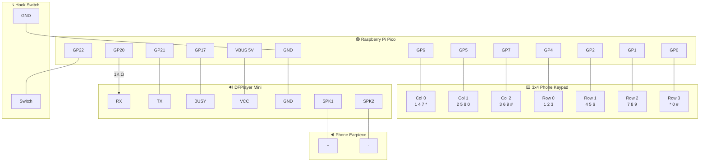
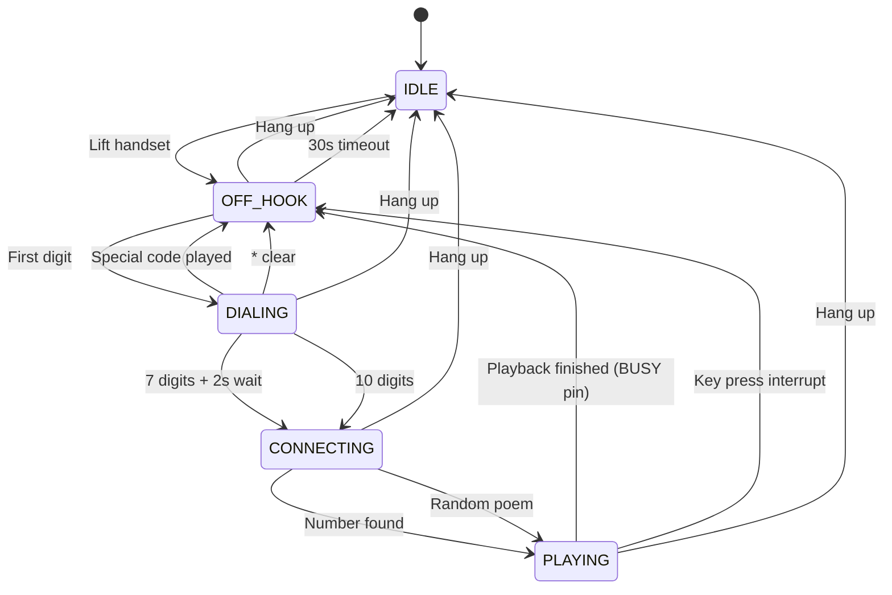

# PhoneHack — Banana Poem Phone

An interactive art installation for the [O'Miami Poetry Festival](https://www.omiami.org/). Dial a number on a real phone keypad, hear ringing, then listen to a poem through the earpiece. Every number leads to a poem — but some numbers hide surprises.

Created by **Mario The Maker**.

Built with a Raspberry Pi Pico, DFPlayer Mini MP3 module, and a salvaged phone handset.

## How It Works

1. Lift the handset — hear a dial tone
2. Dial a 7-digit number — hear DTMF touch tones
3. If the number is in the phonebook — hear ringing, then the mapped poem plays
4. If not — hear ringing, then a random O'Miami poem plays
5. Hang up at any time to reset

## Easter Eggs

| Dial | What happens |
|------|-------------|
| **867-5309** | Jenny Munaweera's poem (Tommy Tutone!) |
| **305-867-5309** | Same — area code gets stripped |
| **555-2368** | "Who are you going to call?... A poet?" (Ghostbusters) |
| **411** | Directory assistance — explains the phone and hints at Easter eggs |
| **305** | O'Miami shoutout |
| **0** | Operator |
| **211** | Community services — "In this city of sun and salt..." |
| **511** | Traffic — "Every road in Miami leads to the ocean..." |
| **611** | Customer service — "All representatives are busy reading poetry..." |
| **711** | Telecom relay — "Every voice deserves to be heard..." |
| **811** | Utility locator — "Beneath every sidewalk, a tangle of roots and wires..." |
| **911** | Emergency redirect — "This is not a real phone" |
| **311** | City services |

All other numbers play a random poem from the 28-poem O'Miami collection.

## Hardware

- Raspberry Pi Pico (RP2040) — MicroPython
- 3x4 membrane phone keypad
- DFPlayer Mini MP3 module (YX5200) — UART, built-in amp
- microSD card (FAT32, ≤32GB) — stores all audio
- Phone handset with 8-ohm earpiece
- Hook switch (normally-open, on this handset)
- 1K resistor (Pico TX → DFPlayer RX)
- DFPlayer BUSY pin → Pico GP17 (end-of-track detection)

See [SPEC.md](SPEC.md) for full wiring diagrams and BOM.

## Wiring Diagram



## GPIO Pinout

| GPIO | Function | Direction |
|------|----------|-----------|
| GP0  | Keypad row 3 (*, 0, #) | Input (pull-up) |
| GP1  | Keypad row 2 (7, 8, 9) | Input (pull-up) |
| GP2  | Keypad row 1 (4, 5, 6) | Input (pull-up) |
| GP4  | Keypad row 0 (1, 2, 3) | Input (pull-up) |
| GP5  | Keypad column 1 | Output |
| GP6  | Keypad column 0 | Output |
| GP7  | Keypad column 2 | Output |
| GP17 | DFPlayer BUSY | Input (pull-up) |
| GP20 | DFPlayer TX (via 1K resistor) | UART1 TX |
| GP21 | DFPlayer RX | UART1 RX |
| GP22 | Hook switch (NO) | Input (pull-up) |

## State Machine



## Dialing Logic

- **7 digits** (xxx-xxxx): waits 2 seconds, then looks up in phonebook
- **10 digits** (xxx-xxx-xxxx): strips area code, looks up last 7
- **Special codes** (3-digit) trigger after 1 second pause:
  - `0` — Operator
  - `211` — Community services
  - `305` — O'Miami!
  - `311` — City services
  - `411` — Directory assistance
  - `511` — Traffic/road conditions
  - `611` — Customer service
  - `711` — Telecommunications relay
  - `811` — Call before you dig
  - `911` — Emergency redirect
- Numbers cannot start with `0` (except operator)
- `*` clears input, `#` is ignored during dialing

## SD Card Layout

The `sd_card/` directory in this repo is the complete SD card image. It is tracked in git so the phone can be fully recreated if the card is lost.

DFPlayer reads the 3-digit prefix and ignores the rest. The suffix is for humans.

```
sd_card/
├── 01/                           ← Sound effects (27 files)
│   ├── 001_dialtone.mp3
│   ├── 002_ringback.mp3
│   ├── 003_busy.mp3
│   ├── 004_hangup.mp3
│   ├── 005_dtmf_0.mp3 … 016_dtmf_hash.mp3
│   ├── 017_operator.mp3
│   ├── 018_not_in_service.mp3
│   ├── 019_311.mp3
│   ├── 020_411.mp3
│   ├── 021_305_omiami.mp3
│   ├── 022_911_emergency.mp3
│   ├── 023_211.mp3
│   ├── 024_511.mp3
│   ├── 025_711.mp3
│   ├── 026_811.mp3
│   └── 027_611.mp3
│
├── 02/                           ← Mapped poems (2 files)
│   ├── 001_Jenny_Munaweera.mp3   ← 867-5309
│   └── 002_ghostbusters.mp3      ← 555-2368
│
└── 03/                           ← Random O'Miami poems (28 files)
    ├── 001_Ana_Martinez.mp3
    ├── 002_Samantha_Desjardins.mp3
    ├── ...
    └── 028_Ariella_Berkowitz.mp3
```

Update `RANDOM_COUNT` in `config.py` if you add or remove poems from `/03/`.

After copying to SD card on macOS: `dot_clean /Volumes/<SDCard>`

## Audio Generation

All voice messages are generated with **ElevenLabs TTS** (Sarah voice, `eleven_multilingual_v2` model). The O'Miami poems use multiple voices matched by poem type and poet gender.

Dial tones and DTMF are synthesized with `tools/generate_tones.py`.

To regenerate the 411 directory listing:
```bash
export ELEVENLABS_API_KEY=your_key_here
python tools/generate_411.py
```

## Deploying to Pico

```bash
mpremote connect /dev/cu.usbmodem1101 cp config.py :config.py + cp phonebook.json :phonebook.json + cp poetry_phone.py :main.py + cp dfplayer.py :dfplayer.py
```

To run without rebooting:
```bash
mpremote connect /dev/cu.usbmodem1101 run poetry_phone.py
```

## Testing Without Hardware

Both the DFPlayer and hook switch are optional. Set in `config.py`:
```python
HOOK_ENABLED = False    # Skip hook switch (always acts off-hook)
AUDIO_ENABLED = False   # Skip DFPlayer (prints debug to console)
```

Run the test suite:
```bash
pytest test/ -v
```

145 tests across 5 test files. Mock framework in `test/mock_micropython.py` uses AST parser to avoid MicroPython imports.

## Files

| File | Deployed | Purpose |
|------|----------|---------|
| `poetry_phone.py` | `:main.py` | Main state machine |
| `config.py` | `:config.py` | All settings (pins, timing, volume, special codes) |
| `dfplayer.py` | `:dfplayer.py` | DFPlayer Mini library |
| `phonebook.json` | `:phonebook.json` | Phone number → poem mappings |
| `sd_card/` | SD card | Full SD card image (tracked in git as backup) |
| `OmiamiPoems/` | No | Source O'Miami poem MP3s (29 poems + HTML player) |
| `tools/` | No | Desktop scripts (tone generators, 411 generator, keypad discovery) |
| `hardware_test/` | No | Hardware validation (DFPlayer, hook switch, BUSY pin) |
| `test/` | No | 145 pytest tests with MicroPython mock framework |
| `SPEC.md` | No | Full hardware/software specification |
| `USER_GUIDE.md` | No | How to add/remove poems and manage the SD card |
