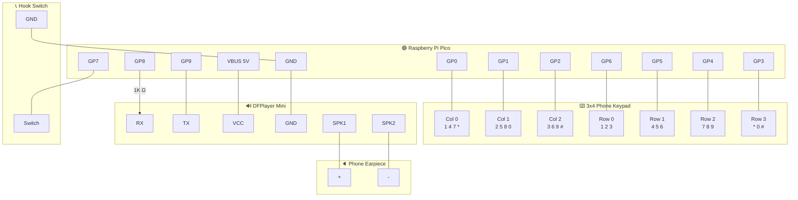
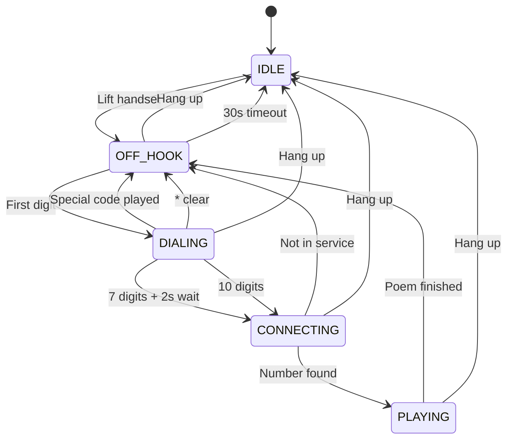

# PhoneHack — Poetry Phone

Dial a number on a real phone keypad, hear ringing, then listen to a poem through the earpiece. Each phone number maps to a different recording.

Built with a Raspberry Pi Pico, DFPlayer Mini MP3 module, and a salvaged phone handset.

## How It Works

1. Lift the handset — hear a dial tone
2. Dial a 7-digit number — hear DTMF touch tones
3. If the number is in the phonebook — hear ringing, then the poem plays
4. If not — "number not in service" message, then busy signal
5. Hang up at any time to reset

## Hardware

- Raspberry Pi Pico (RP2040) — MicroPython
- 3x4 membrane phone keypad
- DFPlayer Mini MP3 module (YX5200) — UART, built-in amp
- microSD card (FAT32, ≤32GB) — stores all audio
- Phone handset with 8-ohm earpiece
- Hook switch (normally-closed)
- 1K resistor (Pico TX → DFPlayer RX)

See [SPEC.md](SPEC.md) for full wiring diagrams and BOM.

## Wiring Diagram



## GPIO Pinout

| GPIO | Function | Direction |
|------|----------|-----------|
| GP0  | Keypad column 0 | Output |
| GP1  | Keypad column 1 | Output |
| GP2  | Keypad column 2 | Output |
| GP3  | Keypad row 3 (*, 0, #) | Input (pull-up) |
| GP4  | Keypad row 2 (7, 8, 9) | Input (pull-up) |
| GP5  | Keypad row 1 (4, 5, 6) | Input (pull-up) |
| GP6  | Keypad row 0 (1, 2, 3) | Input (pull-up) |
| GP7  | Hook switch | Input (pull-up) |
| GP8  | DFPlayer TX (via 1K resistor) | UART1 TX |
| GP9  | DFPlayer RX | UART1 RX |

## State Machine



## Dialing Logic

- **7 digits** (xxx-xxxx): waits 2 seconds, then looks up in phonebook
- **10 digits** (xxx-xxx-xxxx): strips area code, looks up last 7
- **Special codes** trigger after 1 second pause:
  - `0` — Operator
  - `305` — O Miami!
  - `311` — City services
  - `411` — Directory assistance
  - `611`, `711`, `811`, `911` — Service messages
- Numbers cannot start with `0` (except operator)
- `*` clears input, `#` is ignored during dialing

## SD Card Layout

DFPlayer reads the 3-digit prefix and ignores the rest. The suffix is for humans.

```
sd_card/
├── 01/                        ← Sound effects
│   ├── 001_dialtone.mp3
│   ├── 002_ringback.mp3
│   ├── 003_busy.mp3
│   ├── 004_hangup.mp3
│   ├── 005_dtmf_0.mp3 … 016_dtmf_hash.mp3
│   ├── 017_operator.mp3
│   ├── 018_not_in_service.mp3
│   ├── 019_311.mp3
│   ├── 020_411.mp3
│   └── 021_305_omiami.mp3
│
├── 02/                        ← Poems (mapped to phone numbers)
│   ├── 001_8675309.mp3
│   ├── 002_5551212.mp3
│   └── ...
│
└── 03/                        ← Random poems (unknown numbers)
    ├── 001_not_in_service.mp3
    ├── 002_wrong_number.mp3
    ├── 003_lost_call.mp3
    └── ...                    ← Add as many as you like!
```

Unknown numbers play a random poem from `/03/`. Update `RANDOM_COUNT` in `config.py` to match the number of files in this folder.

Generate the sound effects:
```bash
pip install numpy scipy
python generate_tones.py
```

After copying to SD card on macOS: `dot_clean /Volumes/<SDCard>`

## Deploying to Pico

```bash
mpremote connect /dev/cu.usbmodem1101 cp config.py :config.py
mpremote connect /dev/cu.usbmodem1101 cp dfplayer.py :dfplayer.py
mpremote connect /dev/cu.usbmodem1101 cp phonebook.json :phonebook.json
mpremote connect /dev/cu.usbmodem1101 cp poetry_phone.py :main.py
```

To run without rebooting:
```bash
mpremote connect /dev/cu.usbmodem1101 run poetry_phone.py
```

## Testing Without Hardware

Both the DFPlayer and hook switch are optional. Set in `config.py`:
```python
HOOK_ENABLED = False    # Skip hook switch (always acts off-hook)
AUDIO_ENABLED = False   # Skip DFPlayer (prints debug to console)
```

## Files

| File | Deployed | Purpose |
|------|----------|---------|
| `poetry_phone.py` | `:main.py` | Main state machine |
| `config.py` | `:config.py` | All settings (pins, timing, volume) |
| `dfplayer.py` | `:dfplayer.py` | DFPlayer Mini library |
| `phonebook.json` | `:phonebook.json` | Phone number → poem mappings |
| `generate_tones.py` | No | Generates sound effects (run on desktop) |
| `SPEC.md` | No | Full hardware/software specification |
| `hardware_test/` | No | Hardware validation (DFPlayer, hook switch) |
| `utils/` | No | Keypad discovery tools from initial build |
